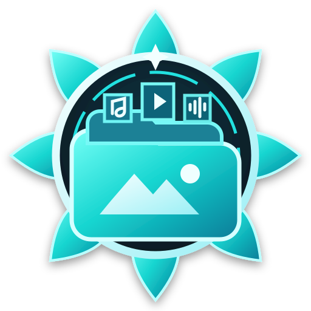

<p align="center">
 <strong>Samael Assets — Shared Project Media Library</strong><br/>
 A centralized library and browser for images, audio, interface resources, documentation assets, and shared static content.<br/>
 Designed for direct linking, GitHub Pages hosting, and reuse across Garry's Mod and web projects.
</p>

<p align="center">
 
</p>

<p align="center">
 <a href="https://bleonheart.github.io/Samael-Assets/">
  
 </a>
 <a href="https://github.com/bleonheart/Samael-Assets/stargazers">
  
 </a>
</p>

---

## Asset Browser

<p align="center">
 <a href="https://bleonheart.github.io/Samael-Assets/">https://bleonheart.github.io/Samael-Assets/</a>
</p>

Samael Assets is both a repository of reusable project media and a lightweight browser for navigating that media without manually digging through GitHub folders.

## Features

### Image Browser

- Automatic repository image discovery
- Folder-based grouping
- Thumbnail navigation
- Previous and next controls
- Automatic slideshow playback
- Configurable slideshow timing
- Keyboard navigation
- Fullscreen viewing
- Direct asset-link copying
- URL state for linking to selected assets

Supported image formats include:

```text
png, jpg, jpeg, gif, webp, bmp, svg
```

### Audio Browser

- Automatic audio discovery
- Folder-based organization
- Folder selection
- Play and pause controls
- Previous and next navigation
- Automatic playback progression
- Direct audio-link copying

Supported audio formats include:

```text
wav, mp3, ogg, flac, m4a, aac, opus
```

## Asset Categories

The repository contains media organized around several projects and systems, including:

- `armor`
- `banking`
- `bonemerge`
- `computer`
- `cuffs`
- `dtcomms`
- `falloutrp`
- `identifications`
- `lockpicking`
- `medals`
- `misc`
- `music`
- `radio`
- `starwarsmenu`
- `status`
- `workshop`

## Direct Linking

Files published through GitHub Pages can be referenced directly by other repositories, documentation pages, websites, and Garry's Mod interfaces.

Pattern:

```text
https://bleonheart.github.io/Samael-Assets/<folder>/<asset>
```

Example:

```text
https://bleonheart.github.io/Samael-Assets/lilia.png
```

This is useful for:

- README images
- Documentation media
- UI assets
- Loading screens
- Web panels
- Audio resources
- Shared project branding

## How the Browser Works

The browser can load media from an optional `assets.json` manifest.

When a manifest is not available, it can discover supported files from the GitHub repository tree and organize them dynamically.

The viewer also supports repository-related URL state so assets can be navigated and shared more directly.

## Local Usage

Clone the repository:

```bash
git clone https://github.com/bleonheart/Samael-Assets.git
cd Samael-Assets
```

Serve it with a static HTTP server:

```bash
python -m http.server 8000
```

Then open:

```text
http://localhost:8000
```

## Repository Structure

```text
Samael-Assets/
├── armor/
├── banking/
├── bonemerge/
├── computer/
├── falloutrp/
├── music/
├── radio/
├── workshop/
├── index.html
├── lilia.png
└── README.md
```

## Adding Assets

When adding new media:

1. Place the file in the most appropriate category
2. Use a descriptive filename
3. Avoid unnecessary duplicates
4. Prefer web-friendly formats where practical
5. Verify the file through the hosted browser
6. Use stable paths when the asset is referenced externally

## Contributing

Improvements to the asset browser, media organization, navigation, or repository tooling are welcome.

1. Fork the repository
2. Create a feature branch
3. Add or improve assets or browser functionality
4. Test direct links and browser discovery
5. Open a pull request describing the changes

---

<p align="center">
 <strong>One repository for reusable project media.</strong>
</p>